# enumerable: LINQ-style Iterators for Go
[](https://github.com/ahatornn/enumerable/actions/workflows/test.yml)

`enumerable` is a Go library inspired by **C# LINQ** (Language Integrated Query) that enables functional-style data processing using **generics** and **lazy iterators**.

With it, you can write clean, readable, and expressive code for filtering, transforming, and aggregating data — without `for` loops or temporary slices.

> Feels like LINQ, but in Go. Lazy evaluation. Generic. Type-safe.

---

## ✨ Features

- ✅ **LINQ-like methods**: `Where`, `Select`, `Take`, `Skip`, `First`, `Any`, `All`, `Count`, and more.
- ✅ **Lazy iterators** — data is processed on-demand.
- ✅ **Generics (Go 1.18+)** — type safety without type casting.
- ✅ **Method chaining** — fluent, readable APIs.
- ✅ **Efficiency** — minimal allocations, suitable for large datasets.
- ✅ **Nil-safe operations** — methods safely handle `nil` sequences without panics.

---

## 🚀 Installation

Use `go get` to add the library to your project:

```bash
go get github.com/ahatornn/enumerable
```

## ⚖️ Comparison: Vanilla Go vs Queryable

Let’s say you want to: Merge two slices, keep numbers greater than 50, skip the first 3, and take the next 2.

### ✅ Using enumerable

```go
nums1 := []int{10, 20, 60, 70}
nums2 := []int{30, 40, 80, 90, 100}

result := enumerable.FromSlice(nums1).
    Union(enumerable.FromSlice(nums2)).
    Where(func(x int) bool { return x > 50 }).
    Skip(3).
    Take(2).
    ToSlice()

fmt.Println(result) // Result: [90 100]
```

### 🛠 Without the library (manual)

```go
nums1 := []int{10, 20, 60, 70}
nums2 := []int{30, 40, 80, 90, 100}

seen := make(map[int]bool)
var union []int

for _, x := range nums1 {
    if !seen[x] {
        seen[x] = true
        union = append(union, x)
    }
}
for _, x := range nums2 {
    if !seen[x] {
        seen[x] = true
        union = append(union, x)
    }
}

var filtered []int
for _, x := range union {
    if x > 50 {
        filtered = append(filtered, x)
    }
}

var result []int
countSkipped := 0
countTaken := 0
for _, x := range filtered {
    if countSkipped < 3 {
        countSkipped++
        continue
    }
    if countTaken < 2 {
        result = append(result, x)
        countTaken++
    } else {
        break
    }
}
```

## ⚙️ Methods
### 🌱 Creation Methods
Initialize new sequences from scratch.
- Often act as entry points to the API.
- May accept minimal input (or none) to generate data.

| Method | Description |
|--|--|
| [`Empty`](./pkg/enumerable/empty.go) | Returns an empty enumerator of type T that yields no values. |
| [`FromChannel`](./pkg/enumerable/from_channel.go) | Creates an [`Enumerator[T]`](./pkg/enumerable/enumerator.go) that yields values received from a channel.<br>The enumeration continues until the channel is closed or the consumer stops iteration. |
| [`FromSlice`](./pkg/enumerable/from_slice.go) | Creates an [`Enumerator[T]`](./pkg/enumerable/enumerator.go) that yields all elements from the input slice in order.. |
| [`Range`](./pkg/enumerable/range.go) | Generates a sequence of consecutive integers starting at 'start', producing exactly 'count' values in ascending order (with step +1). |
| [`Repeat`](./pkg/enumerable/repeat.go) | Generates a sequence containing the same item repeated 'count' times. |

## ⏳ Lazy Methods
Perform deferred computations, evaluating only when needed
- Chainable without intermediate allocations.
- Save memory/CPU until iteration.

| Method | Description |
|--|--|
| [`Concat`](./pkg/enumerable/concat.go) | Combines two enumerations into a single enumeration. The resulting enumeration yields all elements from the first enumeration, followed by all elements from the second enumeration. |
| [`Distinct`](./pkg/enumerable/distinct.go) | Returns an enumerator that yields only unique elements from the original enumeration. Each element appears only once in the result, regardless of how many times it appears in the source.<br/><br/>⚠️ Performance note: This operation buffers all unique elements encountered so far in memory. For enumerations with many unique elements, memory usage can become significant. The operation is not memory-bounded. |
| [`Except`](./pkg/enumerable/except.go) | Returns an enumerator that yields elements from the first enumeration that are not present in the second enumeration. This is equivalent to set difference operation (first - second).<br/><br/>⚠️ Performance note: This operation completely buffers the `second` enumerator into memory (creates a map for fast lookup). For large second enumerations, this may consume significant memory. The memory usage is proportional to the number of unique elements in the second enumerator. |
| [`Intersect`](./pkg/enumerable/intersect.go) |Returns an enumerator that yields elements present in both enumerations. This is equivalent to set intersection operation (first ∩ second).<br/><br/>⚠️ Performance note: The second enumeration is completely loaded into memory to enable fast lookups. Be cautious when using this with very large second enumerations as it may cause high memory usage. |
| [`Skip`](./pkg/enumerable/skip.go) | Bypasses a specified number of elements in an enumeration and then yields the remaining elements. This operation is useful for pagination, skipping headers, or bypassing initial elements. |
| [`SkipLast`](./pkg/enumerable/skip_last.go) | Bypasses a specified number of elements at the end of an enumeration and yields the remaining elements. This operation is useful for removing trailing elements like footers, summaries, or fixed-size endings from sequences.<br/><br/>⚠️ Performance note: This operation buffers up to n elements in memory using a circular buffer for efficient memory usage. For large values of n, this may consume significant memory.<br/>⚠️ Evaluation note: This operation is partially lazy - elements are processed as the enumeration proceeds, but the last n elements are buffered and never yielded. The enumeration must progress beyond n elements to yield earlier ones. |
| [`SkipWhile`](./pkg/enumerable/skip_while.go) | Bypasses elements in an enumeration as long as a specified condition is true and then yields the remaining elements. This operation is useful for skipping elements until a certain condition is met. |
| [`Take`](./pkg/enumerable/take.go) | Returns a specified number of contiguous elements from the start of an enumeration. This operation is useful for pagination, limiting results, or taking samples from sequences. |
| [`TakeLast`](./pkg/enumerable/take_last.go) | Returns a specified number of contiguous elements from the end of an enumeration. This operation is useful for getting the final elements, such as last N records, trailing averages, or end-of-sequence markers.<br/><br/>⚠️ Performance note: This operation buffers up to n elements in memory to track which elements should be yielded. For large values of n, this may consume significant memory. All elements must be processed before any are yielded.<br/>⚠️ Evaluation note: This operation is not lazy in the traditional sense - the entire source enumeration must be consumed before yielding begins. Elements are yielded in order of their appearance in the original enumeration. |
| [`TakeWhile`](./pkg/enumerable/take_while.go) | Returns elements from an enumeration as long as a specified condition is true. This operation is useful for taking elements until a certain condition is met, such as taking elements while they are valid or within a range. |
| [`Union`](./pkg/enumerable/union.go) | Produces the set union of two enumerations by using the default equality comparer. This operation returns unique elements that appear in either enumeration.<br/><br/>⚠️ Performance note: This operation buffers all unique elements encountered so far in memory. For enumerations with many unique elements, memory usage can become significant. The operation is not memory-bounded. |
| [`Where`](./pkg/enumerable/where.go) | Filters an enumeration based on a predicate function. This operation returns elements that satisfy the specified condition. |

## 🪄 Materialize Methods
Convert lazy sequences into concrete data structures.
- Trigger all pending computations.
- Require memory to store results.

| Method | Description |
|--|--|
| [`All`](./pkg/enumerable/all.go) | Determines whether all elements in the enumeration satisfy a predicate. Returns true if every element matches the predicate, or if the enumeration is empty. |
| [`Any`](./pkg/enumerable/any.go) | Determines whether an enumeration contains any elements. This operation is useful for checking if a sequence is non-empty. |
| [`Count`](./pkg/enumerable/any.go) | Returns the number of elements in an enumeration. This operation is useful for determining the size of a sequence.<br/><br/>⚠️ Performance note: This is a terminal operation that must iterate through the entire enumeration to count all elements. For large enumerations, this may be expensive.<br/>⚠️ Memory note: This operation does not buffer elements, but it must process the entire enumeration, which may trigger upstream operations. |
| [`FirstOrDefault`](./pkg/enumerable/first_or_default.go) | Returns the first element of an enumeration, or a default value if the enumeration is empty or nil. |
| [`FirstOrNil`](./pkg/enumerable/first_or_nil.go) | Returns a pointer to the first element of an enumeration. This operation is useful for getting the first element when it exists, with the ability to distinguish between "no elements" and "zero value" cases. |
| [`ForEach`](./pkg/enumerable/foreach.go) | Executes the specified action for each element in the enumeration. This operation is useful for performing side effects like printing, logging, or modifying external state for each element.<br/><br/>⚠️ Performance note: This operation must iterate through the entire enumeration, which may be expensive for large enumerations.<br/>⚠️ Side effects warning: The action function may have side effects. Use with caution in functional programming contexts. |
| [`LastOrDefault`](./pkg/enumerable/last_or_default.go) | Returns the last element of an enumeration, or a default value if the enumeration is empty or nil.<br/><br/>⚠️ Performance note: This is a terminal operation that must iterate through the entire enumeration to find the last element. For large enumerations, this may be expensive.<br/>⚠️ Memory note: This operation does not buffer elements, but it must process the entire enumeration, which may trigger upstream operations. |
| [`LastOrNil`](./pkg/enumerable/last_or_nil.go) | Returns a pointer to the last element of an enumeration, or nil if the enumeration is empty or nil.<br/><br/>⚠️ Performance note: This is a terminal operation that must iterate through the entire enumeration to find the last element. For large enumerations, this may be expensive.<br/>⚠️ Memory note: This operation does not buffer elements, but it must process the entire enumeration, which may trigger upstream operations. |
| [`LongCount`](./pkg/enumerable/long_count.go) | Returns the number of elements in an enumeration as an int64. This operation is useful for determining the size of large sequences where the count might exceed the range of int.<br/><br/>⚠️ Performance note: This is a terminal operation that must iterate through the entire enumeration to count all elements. For large enumerations, this may be expensive.<br/>⚠️ Memory note: This operation does not buffer elements, but it must process the entire enumeration, which may trigger upstream operations. |
| [`SumFloat`](./pkg/enumerable/sum_float.go) | Computes the sum of float32 values obtained by applying a selector function to each element in the enumeration. This operation is useful for calculating totals, aggregates, or numeric summaries with floating-point precision.<br/><br/>⚠️ Performance note: This is a terminal operation that must iterate through the entire enumeration to sum all values. For large enumerations, this may be expensive.<br/>⚠️ Precision warning: Floating-point arithmetic may introduce small rounding errors. Consider using appropriate rounding for display. |
| [`SumInt`](./pkg/enumerable/sum_int.go) | Computes the sum of integers obtained by applying a selector function to each element in the enumeration. This operation is useful for calculating totals, aggregates, or numeric summaries.<br/><br/>⚠️ Performance note: This is a terminal operation that must iterate through the entire enumeration to sum all values. For large enumerations, this may be expensive.<br/>⚠️ Overflow warning: Integer overflow may occur with very large sums. Consider using SumInt64 for larger ranges. |
| [`ToChannel`](./pkg/enumerable/to_channel.go) | Converts an enumeration to a channel that yields all elements. This operation is useful for converting lazy enumerations into channel-based processing pipelines or for interoperability with goroutines.<br/><br/>⚠️ Resource management: This operation starts a goroutine that runs until the enumeration is complete. Always consume all elements or the goroutine may block indefinitely.<br/>⚠️ Blocking behavior: The goroutine will block when trying to send to a full channel if there's no reader. Use appropriate buffer size.<br/>⚠️ Warning: If the returned channel is not fully consumed, the goroutine may leak. Always range over the entire channel or ensure proper cleanup. |
| [`ToMap`](./pkg/enumerable/to_map.go) | Converts an enumeration to a map[T]struct{} for efficient set-like operations. This operation is useful for creating memory-efficient lookup collections or for removing duplicates while materializing an enumeration.<br/><br/>⚠️ Performance note: This is a terminal operation that must iterate through the entire enumeration. For large enumerations, this may be expensive.<br/>⚠️ Memory note: This operation buffers all unique elements in memory. The memory usage depends on the number of unique elements. |
| [`ToSlice`](./pkg/enumerable/to_slice.go) | Converts an enumeration to a slice containing all elements. This operation is useful for materializing lazy enumerations into concrete collections.<br/><br/>⚠️ Performance note: This is a terminal operation that must iterate through the entire enumeration to collect all elements. For large enumerations, this may be expensive in both time and memory.<br/>⚠️ Memory note: This operation buffers all elements in memory. |

## 🧩 Sequence diagram

```mermaid
sequenceDiagram
    participant ToSlice
    participant Take
    participant Skip
    participant Where
    participant Union
    participant Source1 as nums1 [10,20,60,70]
    participant Source2 as nums2 [30,40,80,90,100]

    Note over ToSlice: Materialization starts
    ToSlice->>Take: Get item
    Take->>Skip: Accept (Take counter=0) Get item
    Skip->>Where: Get item
    Where->>Union: Get item
    Union->>Source1: Get item
    Source1-->>Union: 10
    Union-->>Where: 10
    Where->>Union: Reject (10 ≤ 50), Get item
    Union->>Source1: Get item
    Source1-->>Union: 20
    Union-->>Where: 20
    Where->>Union: Reject (20 ≤ 50), Get item
    Union->>Source1: Get item
    Source1-->>Union: 60
    Union-->>Where: 60
    Where-->>Skip: Accept (60 > 50)
    Skip->>Where: Reject (Skip counter=1), Get item
    Where->>Union: Get item
    Union->>Source1: Get item
    Source1-->>Union: 70
    Union-->>Where: 70
    Where-->>Skip: Accept (70 > 50)
    Skip->>Where: Reject (Skip counter=2), Get item
    Where->>Union: Get item
    Union->>Source1: Get item
    Source1-->>Union: no more
    Union->>Source2: Get item
    Source2-->>Union: 30
    Union-->>Where: 30
    Where->>Union: Reject (30 ≤ 50), Get item
    Union->>Source2: Get item
    Source2-->>Union: 40
    Union-->>Where: 40
    Where->>Union: Reject (40 ≤ 50), Get item
    Union->>Source2: Get item
    Source2-->>Union: 80
    Union-->>Where: 80
    Where-->>Skip: Accept (80 > 50)
    Skip->>Where: Reject (Skip counter=3), Get item
    Where->>Union: Get item
    Union->>Source2: Get item
    Source2-->>Union: 90
    Union-->>Where: 90
    Where-->>Skip: Accept (90 > 50)
    Skip->>Take: 90
    Take->>ToSlice: Accept (Take counter=1) 90
    ToSlice->>Take: Get item
    Take->>Skip: Accept (Take counter=1) Get item
    Skip->>Where: Get item
    Where->>Union: Get item
    Union->>Source2: Get item
    Source1-->>Union: 100
    Union-->>Where: 100
    Where-->>Skip: Accept (100 > 50)
    Skip->>Take: 100
    Take->>ToSlice: Accept (Take counter=2) 100
    ToSlice->>Take: Get item
    Take->>ToSlice: Reject no more
    Note over ToSlice: Materialization complete Deliver [90, 100]
```
